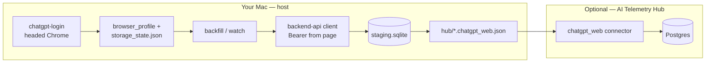

# chatgpt-collector

**Local-first capture of your ChatGPT web history** — for personal memory hubs, telemetry stacks, and unified AI conversation archives.

Authenticate once in a real browser (Google OAuth + OTP friendly), backfill past threads via ChatGPT's `backend-api`, stage locally with dedup, and export hub-ready JSON. No cloud relay. No IDE-only MCP scope.

Built for [AI Telemetry Hub](https://github.com/michaeldriscoll/ai-telemetry-hub) but usable standalone.

---

## The gap this fills

| Approach | What you get | Limitation |
|----------|--------------|------------|
| **Official ChatGPT export** | Full `conversations.json` dump | Manual, batch-only, no incremental sync |
| **MCP / IDE recorder** (e.g. chat-history-recorder-mcp) | Live capture while using Cursor/Codex | Only sessions *in that tool* — not chatgpt.com history, often wrong `model_slug` |
| **Cloud memory SaaS** | Unified search | Your data leaves the machine |
| **chatgpt-collector** (this) | Incremental local backfill + watch | Personal use; API can rate-limit; some stale threads skip (412) |

If you searched for "automated MCP injection for unified memory" and found nothing concrete — this is the **host-side ingest path** most projects skip: headed auth → Bearer-aware API client → SQLite staging → export files your importer already understands.

---

## Architecture



**Design choices (battle-tested):**

1. **Headed login first** — persistent Chrome profile + manual Enter after Google/OTP (same pattern as graded-card / alt.xyz scrapers).
2. **Headed collection default** — headless `storage_state` alone often returns empty API lists; real browser session captures Bearer tokens.
3. **API over DOM** — list/detail via `/backend-api/conversations` and `/backend-api/conversation/{id}`, not sidebar scraping.
4. **Staging + content hash** — idempotent re-runs; skip unchanged rows.
5. **Export contract** — one JSON file per thread: `{uuid}.chatgpt_web.json` with ChatGPT export-shaped `mapping` / `current_node` graph.

---

## Quick start

### Requirements

- macOS or Linux (developed on macOS; Windows untested)
- Python 3.11+ (3.12 recommended; 3.14 works with venv)
- Google Chrome (recommended) or Playwright Chromium
- A ChatGPT account with web history at [chatgpt.com](https://chatgpt.com)

Homebrew Python blocks global `pip install` — **always use a venv**.

```bash
git clone https://github.com/michaeldriscoll/chatgpt-collector.git
cd chatgpt-collector
python3 -m venv .venv
source .venv/bin/activate
python3 -m pip install -e ".[stealth]"
python3 -m playwright install chromium
```

### 1. Login (once, or when session expires)

```bash
chatgpt-collector login
# or: python -m chatgpt_collector login
```

- Chrome opens → sign in with Google → complete OTP/2FA
- Confirm the chat UI loads → press **Enter** in the terminal
- Writes `~/.ai-telemetry-hub/chatgpt-collector/storage_state.json`

### 2. Backfill

```bash
chatgpt-collector backfill --headed
```

Slower = fewer 429 rate limits:

```bash
CHATGPT_COLLECTOR_DELAY_SEC=2.0 chatgpt-collector backfill --headed
```

### 3. Export for your hub / importer

```bash
chatgpt-collector export
# → ~/.ai-telemetry-hub/chatgpt-collector/hub/*.chatgpt_web.json
```

### 4. Incremental watch

```bash
chatgpt-collector watch --headed
chatgpt-collector export
```

### AI Telemetry Hub integration

From the [AI Telemetry Hub](https://github.com/michaeldriscoll/ai-telemetry-hub) repo root:

```bash
make chatgpt-export
make import-chatgpt-web
# or: make chatgpt-sync
```

See [CHATGPT_WEB_COLLECTOR.md](https://github.com/michaeldriscoll/ai-telemetry-hub/blob/main/docs/CHATGPT_WEB_COLLECTOR.md) in the hub repo.

---

## CLI reference

| Command | Purpose |
|---------|---------|
| `login` | Headed browser auth; saves session |
| `backfill` | Fetch all conversations (paginated) |
| `watch` | Recent threads only |
| `export` | Write changed rows to `hub/*.chatgpt_web.json` |
| `sync` | Export + POST to hub API (optional) |
| `status` | Paths, counts, pending export |

**Flags:** `--headed` (default), `--headless` (after headed works), `--profile` (reuse login profile — can crash on macOS), `--max N`, `--timeout-minutes` (login).

---

## Configuration

| Variable | Default | Meaning |
|----------|---------|---------|
| `CHATGPT_COLLECTOR_STATE_DIR` | `~/.ai-telemetry-hub/chatgpt-collector` | Auth, staging, profile |
| `CHATGPT_WEB_STAGING_DIR` | `{state}/hub` | Export output |
| `CHATGPT_COLLECTOR_DELAY_SEC` | `1.25` | Pause between API calls |
| `CHATGPT_COLLECTOR_HEADLESS` | `false` | Default collection mode |
| `CHATGPT_COLLECTOR_USE_PROFILE` | `false` | Reopen login Chrome profile for collect |
| `CHATGPT_LOGIN_TIMEOUT_MINUTES` | `30` | Login wait |
| `AI_TELEMETRY_API` | `http://localhost:8000` | For `sync` command |

---

## Known limitations (documented honestly)

| Issue | Behavior |
|-------|----------|
| **429 Too Many Requests** | Retry with backoff; increase `DELAY_SEC`; re-run backfill (skips stored) |
| **412 stale conversation** | Thread not API-fetchable; skipped permanently after open-in-browser + reload retry |
| **Partial backfill** | First pass may get ~25–40% before rate limits; re-runs fill gaps |
| **API drift** | OpenAI may change `backend-api`; collector may need updates |
| **Terms of use** | Personal, read-your-own-data tooling — not a scraping service |

---

## Export file format

Each file: `{conversation_id}.chatgpt_web.json`

Compatible with ChatGPT official export shape (`mapping`, `current_node`, `model_slug` in message metadata). AI Telemetry Hub imports via `chatgpt_web` connector (`api_family=chatgpt_web`).

---

## Development

```bash
python3 -m venv .venv
source .venv/bin/activate
python3 -m pip install -e ".[dev]"
python -m pytest tests/ -q
```

---

## Related projects

- [AI Telemetry Hub](https://github.com/michaeldriscoll/ai-telemetry-hub) — Postgres-backed memory cockpit with `chatgpt_web` connector
- Vendored copy in hub: `scripts/chatgpt_collector/` (sync on release tags)

---

## License

[MIT](LICENSE). Use responsibly and in line with OpenAI's terms of service for your account.
